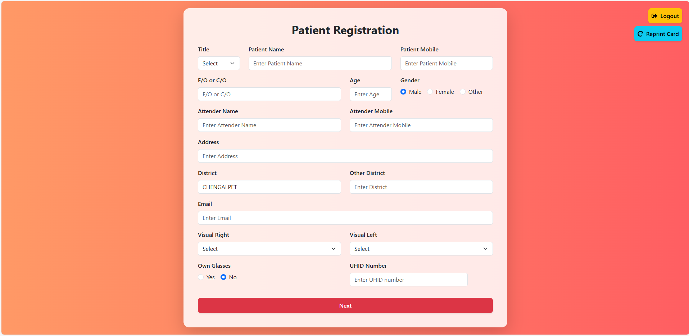

# 👀 EyeCamp - Frontend



🚀 **EyeCamp** is a modern, responsive, and scalable web application built with **Vite + React.js + Bootstrap CSS**. It provides a seamless user experience for managing and organizing eye care camps efficiently.

## 🌟 Features
- 🏥 **Comprehensive UI** for managing patient records and camp registrations
- 🎨 **Sleek & Responsive Design** using Bootstrap CSS
- 🔐 **Secure** authentication with JWT
- ⚡ **Fast and Lightweight** with Vite
- 📊 **Dynamic dashboards & reports** for easy data visualization
- 📱 **Mobile-friendly & responsive design**

## 🚀 Live Demo
🔗 [EyeCamp Frontend](https://eyecamp-aph.netlify.app/) 

## 🛠️ Tech Stack
- **Frontend:** React.js (Vite)
- 🎨 Bootstrap CSS
- 🌍 React Router
- 🔥 React Hooks & Context API for state management
- 🔒 JSON Web Token (JWT) Authentication
- 📡 API Integration with Express.js Backend
- 🐳 **Dockerized** for easy deployment

## 📌 Features
✅ User Authentication (Login & Registration)  
✅ Manage User Data Efficiently  
✅ Responsive Design for all Devices  
✅ Dynamic Form List with Customizable Input Fields  
✅ Admin Dashboard & User Management  
✅ Secure API Calls with JWT Authentication  

## 🛠️ Installation & Setup

```sh
git clone https://github.com/MurugananthamB/eyecamp-frontend.git
cd eyecamp-frontend
npm install
npm run dev
```

Visit: [http://localhost:5173](http://localhost:5173) in your browser. 🎯

## 💡 How to Contribute?
We welcome contributions from the community! 🚀

1. **Fork** the repository
2. **Create a new branch** (`git checkout -b feature-branch`)
3. **Make your changes**
4. **Commit** your changes
5. **Push** to your fork
6. **Open a Pull Request**

## 🛠 Tech Stack
- **Frontend:** Vite + React.js + Bootstrap CSS
- **Backend:** [EyeCamp Backend](https://eyecamp-backend.onrender.com/)
- **Database:** MongoDB
- **Authentication:** JWT
- **Deployment:** Netlify
- **Containerization:** Docker

## 📬 Contact
📧 **Email:** murugananthamanand01212@gmail.com  
🔗 **Portfolio:** <a href="https://mrcreatorportfolio.netlify.app/" target="_blank" rel="noopener noreferrer">MurugananthamB</a>  
🔗 **LinkedIn:** <a href="https://www.linkedin.com/in/murugananthamb/" target="_blank">MurugananthamB</a>  
📌 **GitHub:** <a href="https://github.com/MurugananthamB" target="_blank">MurugananthamB</a>  

---

⚡ Built with ❤️ by **[MurugananthamB](https://github.com/MurugananthamB)**
